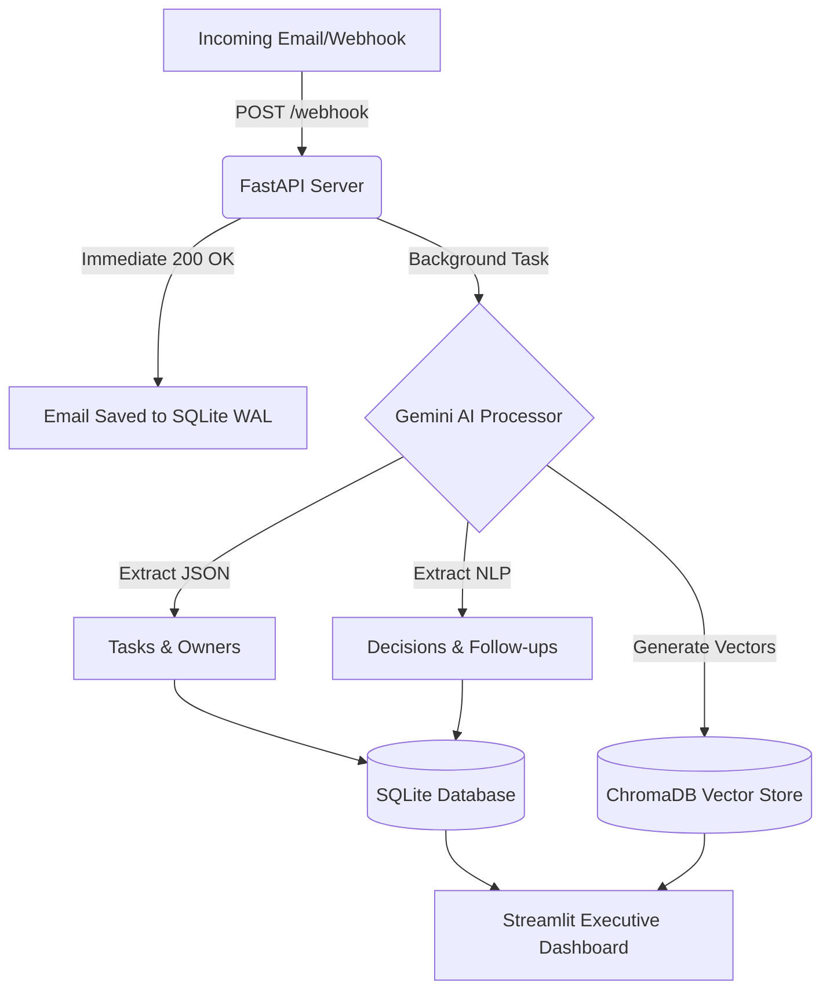

# Group Email Summarizer & Insights Platform (GES)

GES is an enterprise-grade, real-time AI platform designed to aggregate, parse, and extract actionable intelligence from team email threads. Powered by Gemini 2.5 Flash, FastAPI, and ChromaDB, the system automatically builds a semantic knowledge repository and an executive dashboard for managers.

## 🌟 Features
- **Real-Time Webhook Ingestion:** Catch emails live via a highly concurrent FastAPI backend.
- **Fault-Tolerant AI Pipeline:** Intelligent exponential retries ensure no emails are lost during API rate limits.
- **Automated Task Extraction:** Pulls Owners, Tasks, and Due Dates directly from conversational threads.
- **Semantic Vector Search:** True conceptual search powered by ChromaDB.
- **Weekly Executive Intelligence:** Generates cross-thread macro-summaries, identifying team bottlenecks and rendering a downloadable PDF report.

## 🏗️ Architecture



## 🚀 Deployment Instructions

### Prerequisites
- Python 3.10+
- A Google Gemini API Key

### Local Setup
1. Clone this repository.
2. Install dependencies:
   ```bash
   python -m venv venv
   source venv/bin/activate  # On Windows: venv\Scripts\activate
   pip install -r requirements.txt
   ```
3. Create a `.env` file in the root directory and add your API key:
   ```env
   GEMINI_API_KEY=your_gemini_api_key_here
   ```

### Running the Platform
You will need two terminal windows to run the full production architecture:

**Terminal 1: The API Webhook Server**
```bash
uvicorn backend.main:app --reload
```

**Terminal 2: The Executive Dashboard**
```bash
streamlit run frontend/app.py
```

### Simulating an Email
```bash
curl -X POST "http://127.0.0.1:8000/webhook/email" \
     -H "Content-Type: application/json" \
     -d '{
           "from_email": "boss@company.com",
           "subject": "Urgent: Roadmap",
           "body": "Team, finalize the Q4 roadmap by Friday. John, please draft it."
         }'
```
